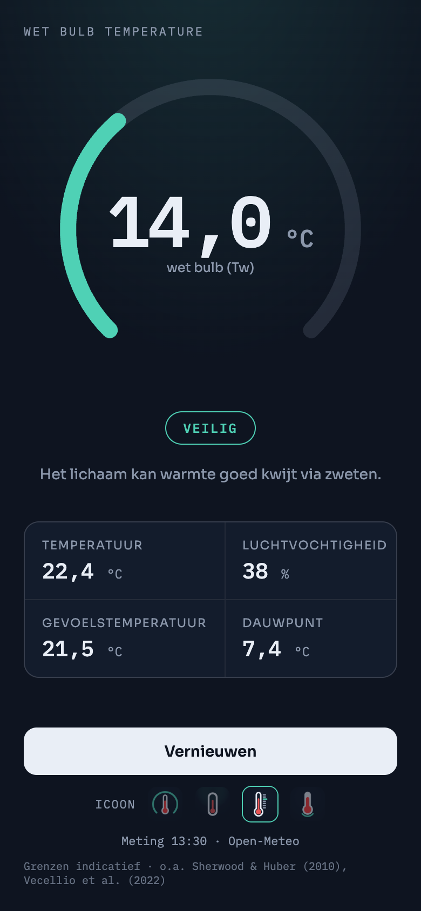

# Wet Bulb Temperature

*Web app showing the current wet-bulb temperature at your location, with a heat-risk level. Interface in six languages (NL, EN, DE, FR, ES, IT).*



Kleine web-app die de actuele wet-bulbtemperatuur (Tw) op je locatie toont, met een risiconiveau erbij. De app draait live op [kramerica-inc-dev.github.io/wet-bulb-temperature](https://kramerica-inc-dev.github.io/wet-bulb-temperature/) en is bedoeld om via Safari op het iPhone-beginscherm te zetten.

De wet-bulbtemperatuur combineert luchttemperatuur en luchtvochtigheid in één getal: de laagste temperatuur die door verdamping (zweten) te bereiken is. Bij hoge luchtvochtigheid verdampt zweet slecht en kan het lichaam zijn warmte niet kwijt; de wet-bulbtemperatuur maakt inzichtelijk wanneer dat gaat knellen. Een gewone temperatuurmeting zegt daar weinig over: 32 °C bij droge lucht is goed vol te houden, bij 80% luchtvochtigheid niet. Naast Tw toont de app de temperatuur, luchtvochtigheid, gevoelstemperatuur en het dauwpunt.

## Op het iPhone-beginscherm zetten

1. Open [de app](https://kramerica-inc-dev.github.io/wet-bulb-temperature/) in Safari.
2. Tik op de deelknop (vierkantje met pijl omhoog).
3. Kies "Zet op beginscherm" en tik op "Voeg toe".

De app opent daarna zonder Safari-balken (standalone) en vraagt bij de eerste start toestemming voor je locatie. De app werkt overigens in elke moderne browser; op Android gaat installeren via Chrome ("Toevoegen aan startscherm").

In het menu (☰ rechtsboven) kun je uit vier iconen kiezen (standaard: de thermometer met meetlat). Doe dat vóór het toevoegen; iOS leest het icoon uit op het moment dat je de app op het beginscherm zet. Later wisselen kan ook, zet de app daarna wel opnieuw op het beginscherm.

## Risiconiveaus

| Tw | Niveau | Betekenis |
|---|---|---|
| onder 23 °C | Veilig | Het lichaam kan warmte goed kwijt via zweten. |
| 23 tot 28 °C | Oppassen | Zware inspanning wordt belastend. Drink voldoende en zoek regelmatig schaduw. |
| 28 tot 31 °C | Gevaarlijk | Risico op oververhitting bij inspanning, ook voor gezonde mensen. Beperk activiteit buiten. |
| 31 tot 35 °C | Zeer gevaarlijk | Ook in rust kan het lichaam warmte nauwelijks kwijt. Blijf in een gekoelde omgeving. |
| vanaf 35 °C | Levensbedreigend | Overleven zonder koeling is niet mogelijk. Zoek direct verkoeling. |

De bovengrens van 35 °C komt uit Sherwood & Huber (2010): boven die wet-bulbtemperatuur kan het lichaam zijn warmte in theorie ook in rust niet meer kwijt. Vecellio et al. (2022) hebben die grens experimenteel getoetst bij jonge, gezonde proefpersonen en vonden dat de werkelijke kritieke waarde lager ligt (gemiddeld rond 30,5 °C in vochtige omstandigheden, bij droge hitte nog lager).

De tussengrenzen (23, 28 en 31 °C) zijn indicatief. Er bestaat geen erkende standaard die waarschuwingsniveaus in zuivere wet-bulbtemperatuur vastlegt; gestandaardiseerde hittestress-grenzen (ISO 7243, vlaggensystemen) zijn gedefinieerd in WBGT, een andere grootheid die naast temperatuur en vocht ook zonnestraling en wind meeweegt. WBGT-waarden en Tw-waarden zijn dus niet uitwisselbaar. De app geeft geen medisch advies: waar de grens ligt verschilt per persoon (leeftijd, gezondheid, mate van inspanning).

## Hoe het werkt

De app-logica zit in één HTML-bestand, zonder build-stap of dependencies (daarnaast alleen een service worker, manifest, fonts en icoon).

* De browser bepaalt de locatie (Geolocation API, na toestemming).
* [Open-Meteo](https://open-meteo.com/) levert de actuele waarden, waaronder `wet_bulb_temperature_2m`. Levert de API die variabele niet, dan rekent de app Tw zelf uit met de benadering van Stull (2011) op basis van temperatuur en luchtvochtigheid. Die benadering geldt voor 5–99% luchtvochtigheid en −20 tot 50 °C bij standaard zeeniveaudruk (behalve bij combinaties van lage vochtigheid en lage temperatuur), met een gemiddelde absolute fout van 0,28 °C.
* [BigDataCloud](https://www.bigdatacloud.com/) vertaalt de coördinaten naar een plaatsnaam (reverse geocoding, client-side).
* Een service worker (`sw.js`) cachet alleen de app-shell zodat de app ook offline opent; weerdata komt niet in die cache.
* De laatste meting staat in localStorage en wordt bij het openen direct getoond, in afwachting van verse data.
* De icoonkeuze staat ook in localStorage; de app zet de `apple-touch-icon`- en manifest-link om naar de gekozen variant (`icons/`, `manifest-a` t/m `-d`).
* De interface is er in zes talen (NL, EN, DE, FR, ES, IT). Standaard volgt de app de browsertaal, met Engels als fallback; kiezen kan in het menu en de keuze wordt in localStorage bewaard. Getallen en tijden volgen de gekozen taal.
* De fonts (Sora, IBM Plex Mono) worden zelf gehost.

## Privacy

Alles draait client-side in de browser. Het enige wat het apparaat verlaat, zijn de coördinaten, en die gaan uitsluitend naar de twee genoemde API's (Open-Meteo voor het weer, BigDataCloud voor de plaatsnaam). Er is geen eigen server en tracking of analytics zit er niet in; API-keys zijn niet nodig, beide diensten werken zonder. Kanttekening bij BigDataCloud: hun endpoint is gratis omdat zij binnenkomende coördinaat/IP-paren gebruiken om hun eigen IP-geolocatiedata te verbeteren.

## Lokaal draaien

```sh
python3 -m http.server
```

Open daarna http://localhost:8000. Een webserver is nodig omdat de Geolocation API en de service worker een secure context vereisen (localhost telt daarvoor mee). Wijzig je een statisch asset (fonts, icoon, manifest), hoog dan de cachenaam in `sw.js` op (`wbt-v1` → `wbt-v2`), anders blijven bezoekers de oude versie zien.

Zelf hosten kan door het repo te forken en GitHub Pages aan te zetten (Settings > Pages, deploy from a branch); meer is er niet voor nodig.

## Bronnen en licentie

* Weerdata: [Open-Meteo](https://open-meteo.com/), geleverd onder [CC BY 4.0](https://creativecommons.org/licenses/by/4.0/) (naamsvermelding vereist).
* Stull, R., 2011: Wet-Bulb Temperature from Relative Humidity and Air Temperature. *Journal of Applied Meteorology and Climatology*, 50 (11), 2267–2269, [doi:10.1175/JAMC-D-11-0143.1](https://doi.org/10.1175/JAMC-D-11-0143.1).
* Sherwood, S. C., & Huber, M., 2010: An adaptability limit to climate change due to heat stress. *Proceedings of the National Academy of Sciences*, 107 (21), 9552–9555, [doi:10.1073/pnas.0913352107](https://doi.org/10.1073/pnas.0913352107).
* Vecellio, D. J., Wolf, S. T., Cottle, R. M., & Kenney, W. L., 2022: Evaluating the 35°C wet-bulb temperature adaptability threshold for young, healthy subjects (PSU HEAT Project). *Journal of Applied Physiology*, 132 (2), 340–345, [doi:10.1152/japplphysiol.00738.2021](https://doi.org/10.1152/japplphysiol.00738.2021).

De code valt onder de [MIT-licentie](LICENSE).
